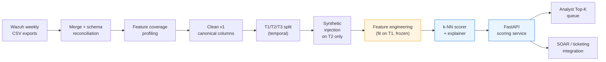

# Ranking-Based Anomaly Detection for SOC Alert Triage on Wazuh SIEM

> Production-deployed ML for analyst-capacity-aware alert ranking in a Managed Detection & Response (MDR) stack.

  

This repository is the **public showcase** of my BSc thesis work at Institut Teknologi Bandung (*Cum Laude*, 2025). The ranking pipeline and scoring service were developed over real Wazuh SIEM telemetry from the Telkom Indonesia CSOC; this repository contains the same code with a synthetic-data generator so anyone can clone and run it end-to-end without the production dataset.

> ### ⚠️ Status: Pilot / Proof of Concept
>
> This is a **first-iteration artifact** that demonstrates the *concept* works: ranking-based ML anomaly detection, integrated with explainability, producing operationally-useful Top-K / Top-p lists on a realistic SIEM corpus. It is **not** a finished production system.
>
> **What "pilot" means concretely:**
> - Results in this repository were measured against curated MITRE-ATT&CK-style **synthetic injections** on the T2 validation window. They validate the *pipeline and methodology*, not the real-world hit-rate against every adversary technique.
> - The feature spine was chosen for **coverage and stability**, not exhaustiveness. Network, geolocation, and MITRE taxonomy signals were intentionally excluded because they are too sparse in the current dataset.
> - No continuous learning loop is present. The current model is frozen after T1 fit.
>
> **What a v2 (production) implementation would add** — see [Future directions](#future-directions-v2--beyond-the-pilot) for the full list:
> 1. A **reinforcement / active-learning loop**: every analyst disposition on a Top-K alert (true positive / false positive / escalate) becomes a labelled example that retrains the ranker on a schedule. This turns the model into a closed-loop system that gets sharper over time instead of drifting.
> 2. **Replace the synthetic validation set with real labelled incidents** accumulated through that loop. The synthetic generator stays useful for unit tests and reproducibility, but no longer sits on the evaluation critical path.
> 3. **Expanded feature spine** once network/geo/MITRE fields are reliably cleaned upstream.

---

## TL;DR

SOC analysts drown in alerts. Rather than frame detection as a binary classification over the full alert corpus, this work reframes it as a **triage budget**: if an analyst can only read the top 1% of each day, the task is to maximise true positives inside that slice. Metrics follow: **precision@p**, **recall@p**, **lift@p**, **FPR@p**.

### Headline result (T3 hold-out, p = 1% daily operating budget)

| Model                       | Precision@1% | Recall@1% | Lift@1% | FPR@1% |
|----------------------------|--------------|-----------|---------|--------|
| **k-NN** (k=35)            | **0.6801**   | **0.2340**| **23.34×** | **0.0033** |
| Isolation Forest (600, 0.5) | 0.4032       | 0.1388    | 13.84×  | 0.0061 |
| LOF (k=20)                 | 0.3010       | 0.1036    | 10.33×  | 0.0072 |

- k-NN beats Isolation Forest by **~1.69×** on precision and LOF by **~2.26×**.
- On T3, the 1%-per-day slice yields **253 true positives** against **119 false positives** (TP:FP ≈ 2.13:1).
- Per-day precision and lift stay in a tight interquartile range — stable without re-tuning.
- Analysts working the Top-K list at the 1% operating point see **23× more true positives** than random sampling.

---

## Problem

At a Managed Detection & Response provider, most daily Wazuh events are medium-severity, with a long tail of low-signal rules, while analyst capacity is fixed. Binary classifiers trained against "anomaly / not anomaly" tend to either:

- optimise global precision at the cost of recall in the slice analysts actually read, or
- flood the queue when decision thresholds drift, silently reverting analysts to triaging by severity.

Reframing detection as *ranking under a budget* makes the operating point explicit, aligns evaluation with how analysts really work, and lets us compare candidate scorers on the axis that matters.

## Approach

### Dataset

- **277,499** Wazuh alerts from a production CSOC index (10 Jul – 12 Aug 2025)
- **5** distinct agents, **2,359** unique source IPs
- Weekly CSV exports, schema-reconciled by `src/pipeline/01_merge_csvs.py`

> The production dataset is not distributed in this repository. A synthetic data generator at `data/synthetic/generate.py` produces a Wazuh-alert-shaped dataset with realistic temporal, severity, rarity, and agent×rule distributions so the pipeline can be run end-to-end without real data. See [Data Statement](#data-statement).

### Train / Validation / Hold-out

| Split | Role | Rows | Notes |
|-------|------|------|-------|
| **T1** | Training window | 214,538 | Feature transformers fit here, then **frozen** |
| **T2** | Validation with curated MITRE ATT&CK-style **synthetic injections** at 1–3%/day | 36,022 | Four injection families: off-hours shift, unseen-rule on host, unseen-decoder on host, severity outlier |
| **T3** | Prospective hold-out | 26,880 | Never touched during model or threshold selection |

**No leakage invariant:** feature transformers (rarity counters, z-score statistics, agent hash tables) are fit on T1 only and frozen for T2/T3 inference. This keeps evaluation honest across re-runs.

### Features

- **Temporal** — hour-of-day, off-hours flag, weekend flag, bucketed periodicity
- **Severity** — per-host z-score of `rule.level` (a rule-level of 10 means different things on different hosts)
- **Rarity** — time-since-last-rule-on-host, hashed agent × rule × hour signatures
- **Light interactions** — selected crosses (off-hours × severity, agent × decoder)

### Models compared

- **k-NN** — distance-based scoring, k swept in {10…50}
- **Isolation Forest** — 600 trees, 0.5 sample fraction
- **LOF** — k=20, `novelty=True` (required for scoring unseen data)

### Explainability

Every top-K alert carries a `reason` payload with:

- **Top contributing features** — ranked by per-feature delta if value is replaced with training-set median
- **Neighbor-median comparator** — what a "normal" alert on this same agent looks like on each feature
- **Context flags** — human-readable summary (`off-hours × severity`, `new rule on this host`, etc.)

The goal is to make the hand-off to the analyst faster: the ranking says *look here*, the explanation says *because of these three things*.

---

## Architecture



The scoring layer plugs into a wider Telkom MDR stack (Wazuh SIEM, Suricata NIDS, DFIR-IRIS case management, YARA/ClamAV/VirusTotal threat-intel). Top-K rankings feed analyst queues and n8n SOAR automation.

---

## Repository layout

```
wazuh-anomaly-triage-ml/
├── src/
│   ├── pipeline/               # data processing scripts, numbered by step
│   │   ├── 01_merge_csvs.py
│   │   ├── 02_profile_coverage.py
│   │   ├── 03_clean.py
│   │   ├── 04_split_T1_T2_T3.py
│   │   └── 05_inject_synthetic.py
│   ├── service/
│   │   ├── fastapi_app.py      # Top-K scoring REST API
│   │   └── gradio_app.py       # interactive demo UI
│   └── score/
│       └── inference.py        # portable model loader + scorer
├── data/
│   └── synthetic/
│       ├── generate.py         # produce a fake Wazuh dataset
│       └── README.md
├── docs/
│   ├── methodology.md          # T1/T2/T3, no-leakage invariant, injection design
│   ├── results.md              # full results table + per-day stability
│   └── architecture.md         # pipeline and service deployment
├── notebooks/
│   └── demo.ipynb              # end-to-end walkthrough on synthetic data
├── tests/
├── requirements.txt
├── LICENSE
└── README.md
```

---

## Quickstart (with synthetic data)

```bash
# 1. Install
python -m venv .venv && source .venv/bin/activate   # or .venv\Scripts\activate on Windows
pip install -r requirements.txt

# 2. Generate a synthetic Wazuh-shaped dataset
python data/synthetic/generate.py --out data/synthetic/wazuh.csv --n 50000 --seed 42

# 3. Run the pipeline end-to-end
python src/pipeline/01_merge_csvs.py   --input-dir data/synthetic         --out data/combined.csv
python src/pipeline/02_profile_coverage.py --input-file data/combined.csv --out-prefix data/coverage --min-pct 0.8
python src/pipeline/03_clean.py        --input data/combined.csv          --output data/cleaned.csv --report-dir docs/cleaning
python src/pipeline/04_split_T1_T2_T3.py --input data/cleaned.csv         --out-dir data/splits
python src/pipeline/05_inject_synthetic.py --input data/splits/T2.csv     --history data/splits/T1.csv --out data/splits/T2_synth.csv

# 4. Launch the scoring service
uvicorn src.service.fastapi_app:app --host 0.0.0.0 --port 8000 --reload

# (or use the Gradio demo)
python src/service/gradio_app.py
```

---

## Limitations

The current ranking layer operates without **behavioural context** (user roles, peer-group baselines, temporal norms) and produces a static list that analysts still interpret alone. Modern SIEM threats — especially insider attacks — often go undetected for months because rule-based defences lack this behavioural dimension. Over 80% of analysts hesitate to act on anomaly alerts without explanations.

Additional honest limits of this pilot:

- **Ground truth is synthetic.** Headline metrics (precision@1% = 0.68, lift = 23.34×) are measured against MITRE-ATT&CK-shaped injections, not verified real incidents. Directional validity is high; absolute validity against wild adversaries is not claimed.
- **Feature coverage is narrow by design.** The "spine" is temporal + severity + rarity. Network/geolocation/MITRE-tactic signals were observed too sparsely to enter the core feature set (< 35% coverage on the real dataset); they remain upstream data-quality work.
- **No feedback loop.** Every run scores independently. The model does not yet learn from analyst dispositions.
- **Single-deployment evidence.** Results are from one MDR environment over 34 days. Cross-environment generalisation is assumed, not proven.

## Future directions (v2 — beyond the pilot)

The pilot demonstrates the *shape* of a solution. A production build adds three layers on top:

### 1. Closed-loop reinforcement / active learning

Every Top-K alert that reaches an analyst returns a disposition: **true positive**, **false positive**, **escalate**, or **benign with context**. These dispositions become a growing labelled corpus that drives:

- **Periodic retraining** of the ranker on the expanding real-incident label set (weekly cadence is typical).
- **Threshold recalibration** at the current operating point so drift is observed, not discovered.
- **Active sample selection** — the next training batch is biased toward examples near the decision boundary, not uniformly over the backlog.
- **Policy-grade rejection** of known-benign patterns (suppression rules that the model learns from repeated "FP" dispositions on the same host × rule × hour signature).

Evaluation target: month-over-month improvement of precision@1% on a rolling holdout of real dispositions, with drift detected and recalibrated automatically.

### 2. Replace the synthetic validation set with real labels

The synthetic generator stays in the repo for unit tests, demos, and reproducibility, but it moves off the evaluation critical path. Production evaluation uses the real-incident label corpus accumulated by the feedback loop above. This closes the gap between "the method works on curated anomalies" and "the system catches the threats this SOC actually sees."

### 3. Context-aware ranking

Incorporate peer-group baselines, historical norms, and threat intelligence into the ranking layer. Evaluation target: does context-enrichment improve precision@1% under insider-threat scenarios where rule-based defences fail? Reference datasets: CERT insider-threat logs, simulated SOC data.

### 4. Agentic triage with explainable LLM reasoning

Wire per-alert reason codes (already produced by this pipeline) as structured input to an LLM agent that performs human-in-the-loop investigation, automatically dismisses low-risk anomalies, and recommends remediation under guardrails. The agent architecture generalises to several research directions that sit at the intersection of security and LLM tool use:

- **Attack-graph integration** — feed ranked anomaly outputs into probabilistic attack-graph models so triage conditions path-likelihood estimates.
- **Agentic security testing** — the same triage-agent architecture generalises to AI-assisted penetration testing and red-team support, where an agent proposes test vectors and interprets results with human oversight.
- **LLM-agent repair pipelines** — explainable reason codes become structured inputs for agents that propose, and under guardrails execute, remediation on the top-ranked anomalies.
- **Supply-chain and SBOM anomaly detection** — the same ranking framing and rarity features port to software-composition and build-time events, where base rates and budget constraints follow the same shape.

---

## Data statement

The thesis was conducted using real Wazuh SIEM data provided by the Telkom Indonesia CSOC division (acknowledged in the published thesis). The production dataset itself is not included in this repository. The code published here is identical in structure to what ran on real data; only the **data source is swapped for a synthetic generator** so the pipeline remains runnable and reviewable.

Separating the implementation from the private dataset is an intentional design choice: it lets this repository be cited, cloned, and extended without compromising the data-handling obligations of the providing organisation, while keeping the original artifact intact as archival evidence.

**Corpus snapshot (from the published thesis):**

- 277,499 raw alerts → 277,440 after deduplication and schema canonisation
- Original schema: 836 columns → reduced to 6 canonical columns after coverage analysis
- Temporal split: T1 = 214,538 (training) · T2 = 36,022 (validation + synthetic injection) · T3 = 26,880 (prospective hold-out)
- Time window: 10 July 2025 17:40 — 12 August 2025 15:44 (Asia/Jakarta)
- 5 distinct agents, 2,359 unique source IPs

---

## Citation

The full BSc thesis (including extensive evaluation, MITRE ATT&CK use case mapping, hyperparameter tuning tables, per-day stability analysis, and Top-K operational analysis) is included in this repository:

- 📄 **[ThesisPub-Putra-Rayhan.pdf](docs/thesis-materials/ThesisPub-Putra-Rayhan.pdf)** — published BSc thesis (Indonesian, 134 pages)
- 📄 **[Abstract-Putra-Rayhan.pdf](docs/thesis-materials/Abstract-Putra-Rayhan.pdf)** — English abstract
- 📄 **[Brief-Putra-Rayhan.pdf](docs/thesis-materials/Brief-Putra-Rayhan.pdf)** — two-page research brief with MSc direction

Machine-readable citation metadata: [`CITATION.cff`](CITATION.cff). If you reference this work, please cite:

> Rayhan Nugraha Putra (2025). *Pengembangan Sistem Deteksi Anomali dan Prioritisasi Ancaman Siber Berbasis Machine Learning pada SIEM Wazuh* [Development of Machine Learning-Based Anomaly Detection and Cyber Threat Prioritization System on Wazuh SIEM]. BSc Thesis, Institut Teknologi Bandung, Sekolah Teknik Elektro dan Informatika, Program Studi Sistem dan Teknologi Informasi. Advisor: Ir. Budi Rahardjo, M.Sc., Ph.D. Graduated *Cum Laude*.

## Author

**Rayhan Putra** — BSc Information Systems & Technology, Institut Teknologi Bandung (2025, Cum Laude, GPA 3.59/4.00). Admitted to KTH Royal Institute of Technology, MSc Cybersecurity, Autumn 2026.

- GitHub: [@SirRay03](https://github.com/SirRay03)
- LinkedIn: [rayhansiregar](https://linkedin.com/in/rayhansiregar)

## License

MIT — see [LICENSE](LICENSE).
