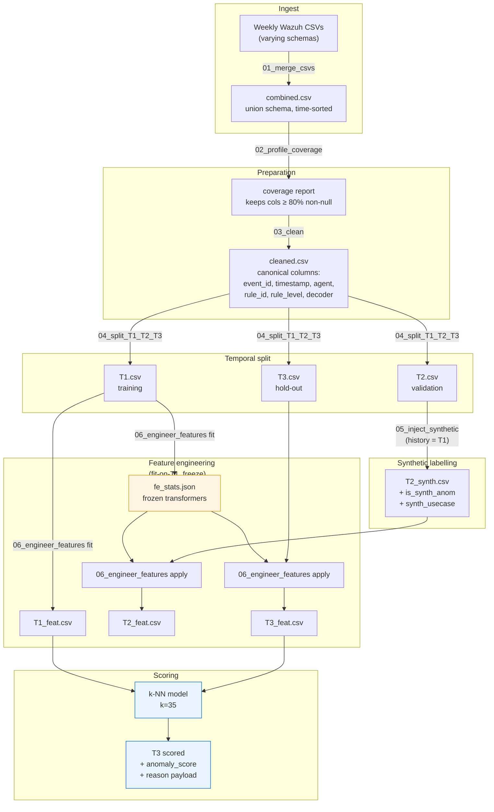
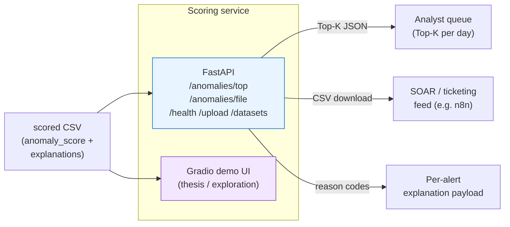

# Architecture

## Data-processing pipeline

The orange block is the **no-leakage invariant**: every reusable statistic
(per-host z-score parameters, recency median, combo frequency table) is
computed once on T1 and frozen into a JSON file. T2 and T3 apply the same
frozen statistics — they never recompute on validation data.

## Service layer

### Endpoints (FastAPI)

| Method | Path | Purpose |
|--------|------|---------|
| `GET` | `/health` | Liveness probe |
| `GET` | `/datasets` | Enumerate CSVs in `DATA_DIR` |
| `POST` | `/upload` | Upload a scored CSV |
| `POST` | `/anomalies/top` | Return Top-K ranked rows as JSON |
| `GET` | `/anomalies/file` | Return Top-K as a downloadable CSV |

If the uploaded CSV already contains an `anomaly_score` column, the
service uses it directly. If not, a lightweight fallback scorer
(`z(rule_level) + off_hours + rarity(agent×rule)`) is applied so the
service remains useful even without a trained model. This is intentional:
the portfolio version of this repo does not ship binary model artifacts,
but the service still demonstrates end-to-end behaviour.

### Deployment path (thesis)

In the thesis deployment, the FastAPI service ran as a Uvicorn worker
with frozen feature transformers pickled alongside the k-NN estimator.
It plugged into a wider Managed Detection & Response stack:

- **Wazuh SIEM** → alert source
- **Suricata NIDS** → parallel detection channel
- **DFIR-IRIS** → case management, consuming the Top-K output
- **YARA / ClamAV / VirusTotal** → threat-intel enrichment
- **n8n** → SOAR automation, reading the CSV download endpoint

Top-K rankings feed analyst queues as ranked, explainable shortlists.
At the 1%-per-day operating point, analysts working from this list see
23× more true positives than random sampling across the same budget.
