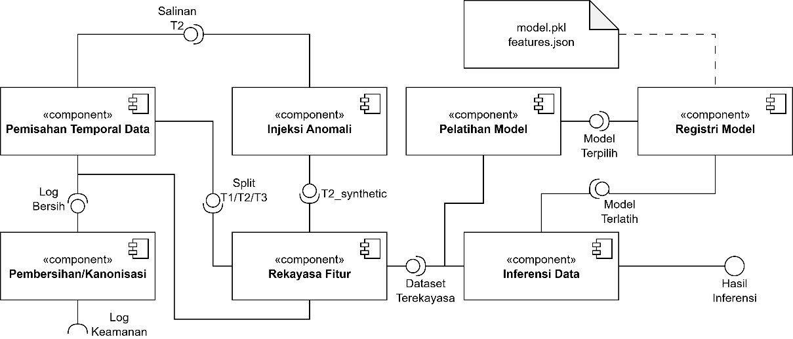
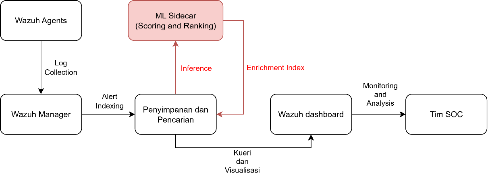
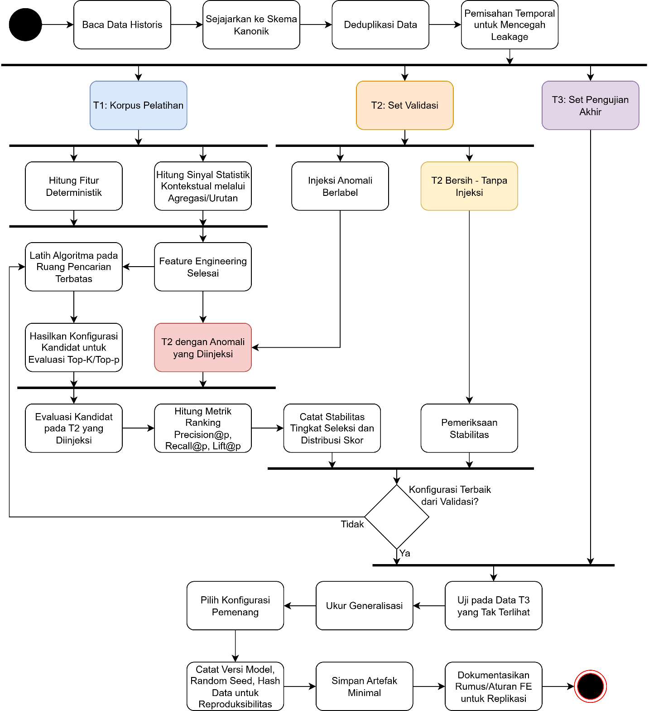
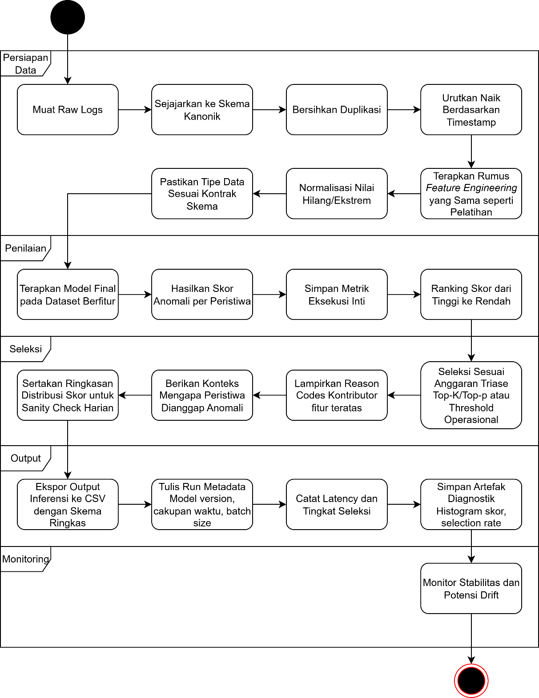
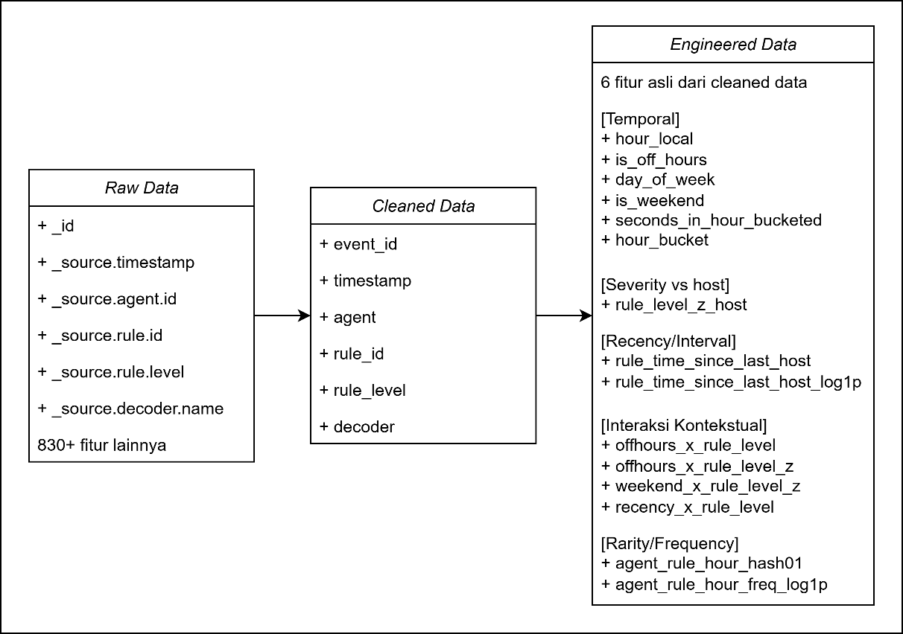

# Architecture

This document mirrors Chapter IV.1 of the thesis (*Gambaran Umum Sistem* —
System Overview). It traces the ML module from its component boundaries, to
its non-invasive integration with the existing Wazuh stack, to the two
activity paths — training and inference — and finally to the canonical
schema that anchors every stage.

## The ML module, as a collection of components

The ML module is built as a layered pipeline with explicit data contracts
between stages, separating data processing, training, inference, and result
serving. Core components: (i) cleaning / canonicalisation, (ii) feature
engineering, (iii) model training and artifact management in a registry,
(iv) inference.

*Figure 4.1 (thesis): Component diagram of the machine-learning module.
Model artifacts (model file + feature list) are serialised to the artifact
store so they can be loaded statelessly at inference time.*

## Non-invasive integration with Wazuh

The ML solution is operated as a **sidecar service** that is separate from
Wazuh's critical path. It runs with read-only access to the alert feed that
Wazuh already produces — via the Wazuh API, a scheduled file-based export,
or a syslog mirror — and pulls data with backpressure so it adds no load to
the ingestion path. It does not touch the Rule and Decoder Framework, the
Analysis Engine, or agent configuration.

*Figure 4.2 (thesis): ML sidecar integration. Inference results are written
to a separate immutable enrichment store (score, rank, reason codes) and
joined back to the original alert through a correlation key (alert_id).*

Key properties of this sidecar posture:

- **Stateless at inference time**, idempotent, supports batch or near-real-time streaming.
- **Fails open**: if the module stops, the SIEM flow continues normally — there is no inline dependency.
- **Safe rollout**: enable/disable via feature flag; separate routing allows rollback, canary, or blue–green deployment with no downtime.

The enrichment payload (score, rank, reason codes) can be presented in a
companion dashboard or a supplementary panel without modifying the stock
Wazuh Dashboard.

## Training process

Training produces two stable outputs: a **frozen model artifact** and a
**documented, deterministic feature-engineering policy**. Inference over
fresh data then remains stateless because it applies the same computation
rules without any refit.

*Figure 4.3 (thesis): Training activity diagram. The eight-step procedure
below reproduces this flow.*

1. **Read & canonicalise.** Read historical data, align to the canonical
   schema (core columns, types, timezone), deduplicate, and split
   temporally to prevent leakage: T1 (training / fit), T2 (validation), T3
   (final test).
2. **Compute features on T1.** Deterministic features are computed inline;
   contextual statistics are computed while processing T1 via
   groupby/order. No separate FE parameter serialisation is required — the
   same formulae are reapplied consistently to T2, T3, and live inference.
3. **Train candidates.** Operationally relevant algorithms (k-NN,
   Isolation Forest, LOF) are trained over a bounded, latency-realistic
   search space. This produces a pool of candidate configurations ready
   for Top-K / Top-p evaluation.
4. **Curate labelled T2 with synthetic injections.** To get a controlled
   performance signal, T2 is injected with ATT&CK-flavoured synthetic
   anomalies (off-hours activity, rare rule/decoder per host, severity
   outliers). Candidates are then evaluated on the injected T2 using
   ranking metrics at multiple *p* or *K* values representative of a
   budgeted triage.
5. **Sanity-check on un-injected T2.** Unlabelled T2 is used for
   non-metric checks — anomaly score distribution, daily selection rate,
   drift indications.
6. **Generalisation test on T3.** The winning configuration from step 4
   is evaluated on T3 as unseen data. Focus: does the model stay stable in
   selection rate, score distribution, and relevance when conditions
   change?
7. **Select winning configuration.** Chosen on the primary T2-injected
   metric, tie-broken by latency, memory footprint, and ease of
   explanation, plus consistency with un-injected T2 and T3. Record
   `model_version`, random seed, and data hash.
8. **Save minimal artifacts.** Store the model file and the version
   manifest. FE parameters are *not* serialised in the current
   implementation; all FE rules are documented so the process can be
   replicated, and parameters can be serialised alongside training logs
   and metric reports in a future version.

## Inference process

Inference uses the final model and the same feature-engineering logic
fixed during training. Unlike training, inference never fits — it runs
statelessly on top of the operational pipeline.

*Figure 4.4 (thesis): Inference activity diagram.*

Daily inputs are canonicalised exports of alerts, projected into the same
feature space as training, then scored, ranked, and sliced to the triage
budget (Top-K / Top-p). The output is enriched with lightweight
explainability and prepared for downstream integration so SOC analysts
immediately receive an actionable priority list.

End-to-end chronology:

1. Load raw logs, align to the canonical schema, drop duplicates, sort by
   timestamp.
2. Apply the same feature-engineering formulae used during training.
3. Normalise missing/extreme values (e.g. clipping), set defaults for
   categories never seen before, enforce schema contract types.
4. Apply the final model to the feature dataset to produce a per-event
   **anomaly score**. Record core execution metrics (row count, duration,
   inference latency).
5. Rank scores descending; select according to the operational triage
   budget (Top-K / Top-p or threshold).
6. Attach **reason codes** (top contributing features) to each selected
   alert, explaining *why* an event was considered anomalous. Include a
   score-distribution summary as a daily sanity check.
7. Export inference output to an agreed medium — for example a CSV with a
   compact schema containing event identity, timestamp, source context,
   anomaly score, rank, and explanation summary.
8. Write run metadata (model version, data time window, batch size,
   latency, selection rate) and save diagnostic artifacts (score
   histogram, selection rate) for monitoring stability and potential
   drift.

## Schema evolution

Schema is deliberately layered: start from a minimal, reliable **spine**
based on what the SIEM actually emits, then evolve into richer
representations for analytical and operational needs. The goal is to
balance auditability (clean lineage back to the raw SIEM) with a signal
surface informative enough for anomaly ranking, without making the schema
brittle or hard to replicate.

*Figure 4.8 (thesis): Schema evolution from raw data → cleaned canonical
data → engineered features.*

Three stages:

1. **Raw → Cleaned (canonical).** A `canonical cleaning` step normalises
   column names and types, then filters to a high-coverage subset that
   appears consistently across agents and decoders. Output is a cleaned
   table with six columns: `event_id, timestamp, agent, rule_id,
   rule_level, decoder`. Quality gates are enforced (missing values, wrong
   types, impossible timestamps); non-conforming rows are dropped.
2. **Cleaned → Engineered features.** Feature engineering produces
   deterministic numerical features so training and inference yield
   consistent results. Features emphasise high cross-agent/cross-decoder
   coverage, so the feature dictionary used at training time is identical
   to what the inference step sees.
3. **Stable columns are preserved** throughout the pipeline with their
   raw names, so lineage, audit, and reconciliation back to the SIEM
   source remain trivial.

### Endpoints (FastAPI)

The sidecar exposes a minimal, stable contract that downstream tooling can
rely on across model versions:

| Method | Path | Purpose |
|--------|------|---------|
| `GET` | `/health` | Liveness probe |
| `GET` | `/datasets` | Enumerate CSVs in `DATA_DIR` |
| `POST` | `/upload` | Upload a scored CSV |
| `POST` | `/anomalies/top` | Return Top-K ranked rows as JSON |
| `GET` | `/anomalies/file` | Return Top-K as a downloadable CSV |

If the uploaded CSV already contains an `anomaly_score` column, the
service uses it directly. If not, a lightweight fallback scorer
(`z(rule_level) + off_hours + rarity(agent×rule)`) is applied so the
service remains useful even without a trained model. This is intentional:
the portfolio version of this repo does not ship binary model artifacts,
but the service still demonstrates end-to-end behaviour.

### Deployment context (thesis)

In the original Telkom MDR deployment, the FastAPI service ran as a
Uvicorn worker with frozen feature transformers pickled alongside the
k-NN estimator, plugged into a wider stack: **Wazuh SIEM** (alert
source), **Suricata NIDS** (parallel detection), **DFIR-IRIS** (case
management consuming Top-K output), **YARA / ClamAV / VirusTotal**
(threat-intel enrichment), **n8n** (SOAR automation reading the CSV
download endpoint). At the 1%-per-day operating point, analysts working
the ranked list see **23× more true positives** than random sampling
across the same budget.
