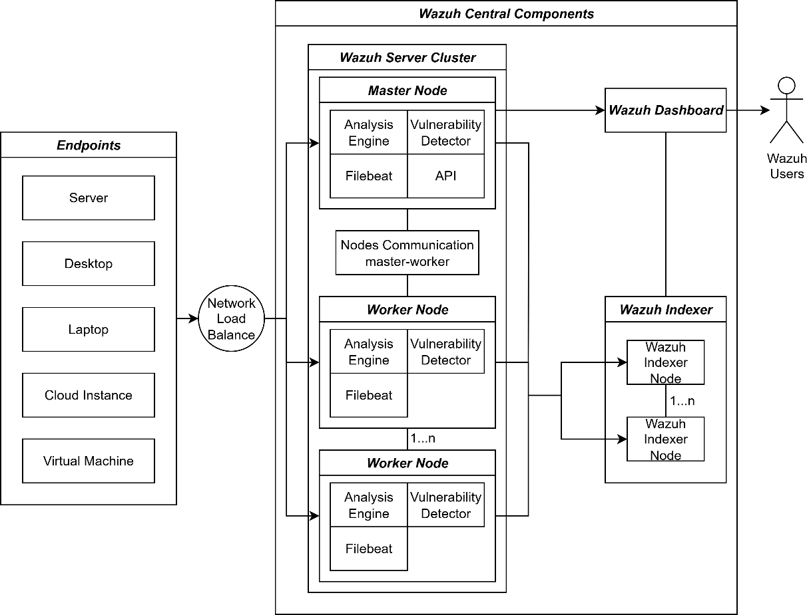
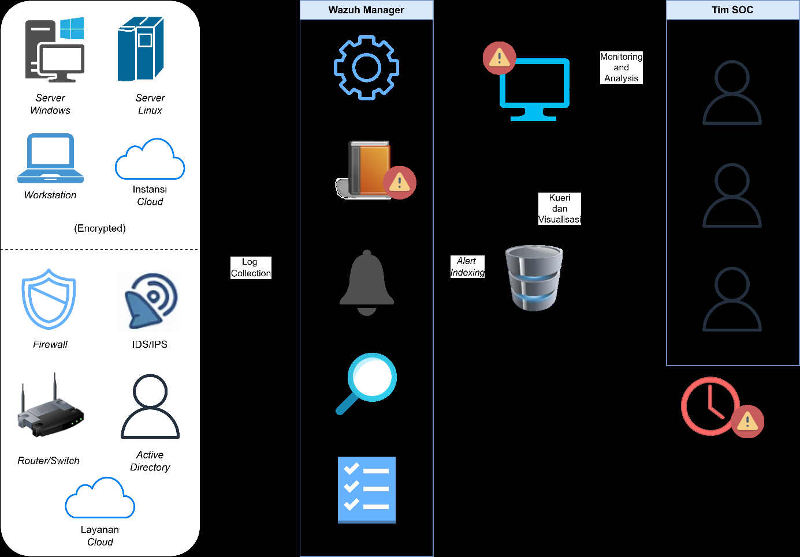
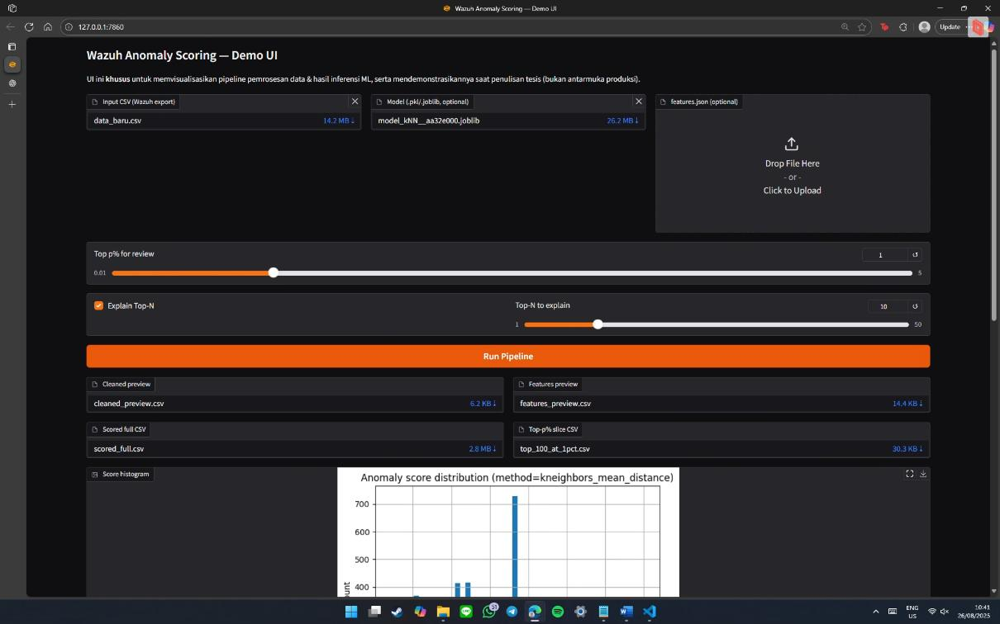
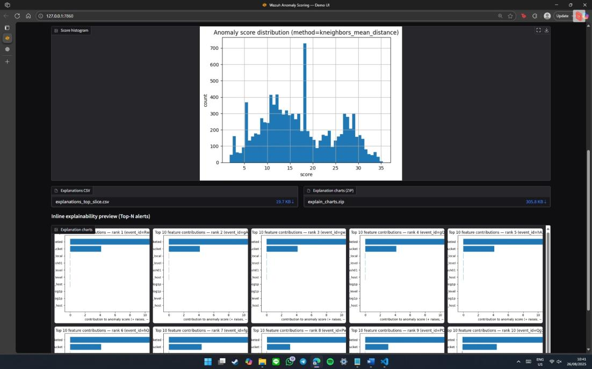

# Architecture

This document mirrors Chapter IV.1 of the thesis (*Gambaran Umum Sistem* —
System Overview). It traces the ML module from its component boundaries, to
its non-invasive integration with the existing Wazuh stack, to the two
activity paths — training and inference — and finally to the canonical
schema that anchors every stage.

## The ML module, as a collection of components

The ML module is built as a layered pipeline with explicit data contracts
between stages, separating data processing, training, inference, and result
serving. Core components: (i) cleaning / canonicalisation, (ii) feature
engineering, (iii) model training and artifact management in a registry,
(iv) inference.


*Figure 4.1 (thesis): UML component diagram of the ML module. Raw
security logs flow into **Pembersihan/Kanonisasi** (cleaning &
canonicalisation), then **Pemisahan Temporal Data** (temporal split
into T1/T2/T3) and **Rekayasa Fitur** (feature engineering). A copy of
T2 is fed to **Injeksi Anomali** to produce a labelled `T2_synthetic`
stream. **Pelatihan Model** consumes the engineered dataset, writes a
**Model Terpilih** to the **Registri Model** (along with `model.pkl`
and `features.json`). The **Inferensi Data** component loads the
trained model from the registry to produce **Hasil Inferensi**.*

## Non-invasive integration with Wazuh

For context, the stock Wazuh architecture — before the ML module is added —
looks like this:



*Figure 2.2 (thesis, adapted from Wazuh 2025): Standard Wazuh cluster —
endpoints feed a Master/Worker node that runs the Analysis Engine, Filebeat,
the Vulnerability Detector and API. Alerts are indexed by the Wazuh Indexer
nodes and visualised through the Wazuh Dashboard.*

And the operational context inside a SOC — the pre-ML baseline that
motivates the ranking layer — is the one documented in the thesis
problem-analysis chapter:



*Figure 3.1 (thesis): SOC data flow before ML. Endpoints + external
sources feed the Wazuh Manager modules (Analysis Engine, Rule and Decoder
Framework, Alerting, Vulnerability Detector, Regulatory Compliance), which
produce alerts into storage/search. The SOC team (Security Analyst, SOC
Manager, Incident Responder) then has to do **manual correlation and
prioritisation** on top of an already-noisy stream — the exact bottleneck
the ML sidecar relieves.*

The ML solution is operated as a **sidecar service** that is separate from
Wazuh's critical path. It runs with read-only access to the alert feed that
Wazuh already produces — via the Wazuh API, a scheduled file-based export,
or a syslog mirror — and pulls data with backpressure so it adds no load to
the ingestion path. It does not touch the Rule and Decoder Framework, the
Analysis Engine, or agent configuration.


*Figure 4.2 (thesis): ML sidecar integration. The sidecar reads from the
same `Penyimpanan dan Pencarian` (Storage and Search) index that the
Wazuh Dashboard queries, performs **Inference**, and writes an
**Enrichment Index** back to storage. The Wazuh Dashboard and SOC team
read the enriched alerts through the normal query path — no change to
agents, Wazuh Manager, or analyst workflow.*

Key properties of this sidecar posture:

- **Stateless at inference time**, idempotent, supports batch or near-real-time streaming.
- **Fails open**: if the module stops, the SIEM flow continues normally — there is no inline dependency.
- **Safe rollout**: enable/disable via feature flag; separate routing allows rollback, canary, or blue–green deployment with no downtime.

The enrichment payload (score, rank, reason codes) can be presented in a
companion dashboard or a supplementary panel without modifying the stock
Wazuh Dashboard.

## Training process

Training produces two stable outputs: a **frozen model artifact** and a
**documented, deterministic feature-engineering policy**. Inference over
fresh data then remains stateless because it applies the same computation
rules without any refit.


*Figure 4.3 (thesis): UML activity diagram of the training process.
Top swimlane — shared pre-processing: read historical data, align to
canonical schema, deduplicate, split temporally (T1 / T2 / T3).
Middle swimlanes — per-split work: deterministic features + T1
contextual statistics; synthetic anomaly injection into a copy of T2
to form the labelled validation set; "clean" T2 reserved for
non-metric sanity checks. Lower swimlanes — candidate training,
budgeted-triage evaluation (Precision@p, Recall@p, Lift@p), stability
checks, final configuration selection, T3 generalisation test, model
version + seed + data-hash recording, and minimal-artifact
serialisation.*

1. **Read & canonicalise.** Read historical data, align to the canonical
   schema (core columns, types, timezone), deduplicate, and split
   temporally to prevent leakage: T1 (training / fit), T2 (validation), T3
   (final test).
2. **Compute features on T1.** Deterministic features are computed inline;
   contextual statistics are computed while processing T1 via
   groupby/order. No separate FE parameter serialisation is required — the
   same formulae are reapplied consistently to T2, T3, and live inference.
3. **Train candidates.** Operationally relevant algorithms (k-NN,
   Isolation Forest, LOF) are trained over a bounded, latency-realistic
   search space. This produces a pool of candidate configurations ready
   for Top-K / Top-p evaluation.
4. **Curate labelled T2 with synthetic injections.** To get a controlled
   performance signal, T2 is injected with ATT&CK-flavoured synthetic
   anomalies (off-hours activity, rare rule/decoder per host, severity
   outliers). Candidates are then evaluated on the injected T2 using
   ranking metrics at multiple *p* or *K* values representative of a
   budgeted triage.
5. **Sanity-check on un-injected T2.** Unlabelled T2 is used for
   non-metric checks — anomaly score distribution, daily selection rate,
   drift indications.
6. **Generalisation test on T3.** The winning configuration from step 4
   is evaluated on T3 as unseen data. Focus: does the model stay stable in
   selection rate, score distribution, and relevance when conditions
   change?
7. **Select winning configuration.** Chosen on the primary T2-injected
   metric, tie-broken by latency, memory footprint, and ease of
   explanation, plus consistency with un-injected T2 and T3. Record
   `model_version`, random seed, and data hash.
8. **Save minimal artifacts.** Store the model file and the version
   manifest. FE parameters are *not* serialised in the current
   implementation; all FE rules are documented so the process can be
   replicated, and parameters can be serialised alongside training logs
   and metric reports in a future version.

## Inference process

Inference uses the final model and the same feature-engineering logic
fixed during training. Unlike training, inference never fits — it runs
statelessly on top of the operational pipeline.


*Figure 4.4 (thesis): UML activity diagram of the inference process,
organised into five swimlanes: **Data preparation** (load raw logs,
align to canonical schema, deduplicate, sort by timestamp, apply the
same feature-engineering formulas as training, handle missing/extreme
values, enforce schema contract); **Scoring** (apply final model, produce
per-event anomaly score, capture execution metrics, rank
high-to-low); **Selection** (slice by Top-K / Top-p or operational
threshold, attach reason codes for the top contributors, include
score-distribution summary as daily sanity check); **Output** (export
inference results to the agreed CSV schema, write run metadata, log
latency and selection rate, save diagnostic artefacts — histogram,
selection rate); **Monitoring** (watch stability and potential drift
downstream).*

Daily inputs are canonicalised exports of alerts, projected into the same
feature space as training, then scored, ranked, and sliced to the triage
budget (Top-K / Top-p). The output is enriched with lightweight
explainability and prepared for downstream integration so SOC analysts
immediately receive an actionable priority list.

End-to-end chronology:

1. Load raw logs, align to the canonical schema, drop duplicates, sort by
   timestamp.
2. Apply the same feature-engineering formulae used during training.
3. Normalise missing/extreme values (e.g. clipping), set defaults for
   categories never seen before, enforce schema contract types.
4. Apply the final model to the feature dataset to produce a per-event
   **anomaly score**. Record core execution metrics (row count, duration,
   inference latency).
5. Rank scores descending; select according to the operational triage
   budget (Top-K / Top-p or threshold).
6. Attach **reason codes** (top contributing features) to each selected
   alert, explaining *why* an event was considered anomalous. Include a
   score-distribution summary as a daily sanity check.
7. Export inference output to an agreed medium — for example a CSV with a
   compact schema containing event identity, timestamp, source context,
   anomaly score, rank, and explanation summary.
8. Write run metadata (model version, data time window, batch size,
   latency, selection rate) and save diagnostic artifacts (score
   histogram, selection rate) for monitoring stability and potential
   drift.

## Schema evolution

Schema is deliberately layered: start from a minimal, reliable **spine**
based on what the SIEM actually emits, then evolve into richer
representations for analytical and operational needs. The goal is to
balance auditability (clean lineage back to the raw SIEM) with a signal
surface informative enough for anomaly ranking, without making the schema
brittle or hard to replicate.


*Figure 4.8 (thesis): UML class diagram of schema evolution. **Raw
Data** (`_id`, `_source.timestamp`, `_source.agent.id`,
`_source.rule.id`, `_source.rule.level`, `_source.decoder.name`, and
830+ other fields) → **Cleaned Data** (six canonical columns:
`event_id`, `timestamp`, `agent`, `rule_id`, `rule_level`,
`decoder`) → **Engineered Data** (the six originals plus 15
engineered features grouped into Temporal, Severity vs host,
Recency/Interval, Interaksi Kontekstual, and Rarity/Frequency).*

Three stages:

1. **Raw → Cleaned (canonical).** A `canonical cleaning` step normalises
   column names and types, then filters to a high-coverage subset that
   appears consistently across agents and decoders. Output is a cleaned
   table with six columns: `event_id, timestamp, agent, rule_id,
   rule_level, decoder`. Quality gates are enforced (missing values, wrong
   types, impossible timestamps); non-conforming rows are dropped.
2. **Cleaned → Engineered features.** Feature engineering produces
   deterministic numerical features so training and inference yield
   consistent results. Features emphasise high cross-agent/cross-decoder
   coverage, so the feature dictionary used at training time is identical
   to what the inference step sees.
3. **Stable columns are preserved** throughout the pipeline with their
   raw names, so lineage, audit, and reconciliation back to the SIEM
   source remain trivial.

### Worked example — a single alert through all three stages

The thesis includes concrete examples that make the transformation
tangible. The same three examples are reproduced below (Figures 4.5,
4.6, 4.7 in the thesis).

**Raw Wazuh export (Figure 4.5).** A single row from the source CSV is
long, semi-structured, nested JSON-in-CSV, with a very long tail of
sparse columns:

```csv
YhYrEpgBc39YxYtcK5OB,wazuh-alerts-4.x-2025.07.16,1,2025-07-16 14:37:50.858000+00:00, , , , , ,0, ,,wazuh-manager-vm.asia-southeast2-b.c.telkom-mdr.internal, , , , ,
... (hundreds of empty separators) ...
,modsec, ,"Jul 16 07:37:50 target-vuln-web-waf modsec:{""transaction"":{""client_ip"":""125.160.225.0"",""time_stamp"":""Wed Jul 16 07:37:50 2025"",""server_id"":""...""
... (embedded ModSecurity transaction JSON, thousands of characters) ...
"}}",1752651470.3687274,log,35.219.17.237,wazuh-manager-vm.asia-southeast2-b.c.telkom-mdr.internal,target-vuln-web-waf,modsec,Jul 16 07:37:50, , , , , ,ModSecurity log detected,6, , , ,"[""modsec""]", ,100100, , ,5,False,...,"Jul 16, 2025 @ 14:37:50.858",1
```

**Cleaned canonical row (Figure 4.6).** After `03_clean.py`, the same
event is six columns long — nothing more, nothing less:

```csv
YhYrEpgBc39YxYtcK5OB,2025-07-16 14:37:50.858,wazuh-manager-vm.asia-southeast2-b.c.telkom-mdr.internal,100100,5,modsec
```

**Engineered feature row (Figure 4.7).** After `06_engineer_features.py
apply`, the six canonical fields are joined by the numerical feature
vector the model consumes (temporal, severity-z, recency, interactions,
rarity):

```csv
YhYrEpgBc39YxYtcK5OB,2025-07-16 14:37:50.858,wazuh-manager-vm.asia-southeast2-b.c.telkom-mdr.internal,100100,5,modsec,14,0,2,0,3,2,0.14993270226727204,1.6,0.9555114450274363,0,0.0,0.0,4.777557225137182,0.7733470568837009,9.328212292571072
```

Two things to notice: (1) the `event_id` and `timestamp` survive
unchanged through all three stages — lineage to the raw SIEM record is
never lost; (2) the feature values are bounded and interpretable
(`hour_local=14`, `is_off_hours=0`, `is_weekend=2`, `day_of_week=2`,
etc.), so reason codes produced downstream can be traced straight back
to this row.

### Endpoints (FastAPI)

The sidecar exposes a minimal, stable contract that downstream tooling can
rely on across model versions:

| Method | Path | Purpose |
|--------|------|---------|
| `GET` | `/health` | Liveness probe |
| `GET` | `/datasets` | Enumerate CSVs in `DATA_DIR` |
| `POST` | `/upload` | Upload a scored CSV |
| `POST` | `/anomalies/top` | Return Top-K ranked rows as JSON |
| `GET` | `/anomalies/file` | Return Top-K as a downloadable CSV |

If the uploaded CSV already contains an `anomaly_score` column, the
service uses it directly. If not, a lightweight fallback scorer
(`z(rule_level) + off_hours + rarity(agent×rule)`) is applied so the
service remains useful even without a trained model. This is intentional:
the portfolio version of this repo does not ship binary model artifacts,
but the service still demonstrates end-to-end behaviour.

### Sample API response (Figure 4.21 in the thesis)

The response schema is stable across simulation and the real pipeline —
only the `pipeline.model` fields and the `items[]` rows are populated
when the trained model is wired in:

```json
{
  "request_id": "rpt_mock_20250824_053848Z",
  "window": {
    "from": null,
    "to": null,
    "timezone": "Asia/Jakarta",
    "input_rows": 26880,
    "filtered_rows_24h": 26880
  },
  "pipeline": {
    "cleaned_rows": 26880,
    "feature_engineered_rows": 26880,
    "model": { "name": null, "version": null }
  },
  "selection": { "mode": "fixed", "value": 10, "count": 10 },
  "artifact_csv": "artifacts/top10_T3_scored_mock.csv",
  "items": [
    {
      "event_id": "703267391",
      "timestamp": "2024-08-05T12:02:09",
      "agent": "linux-agent-02",
      "rule_id": "5712",
      "decoder": "audit",
      "rule_level": 12,
      "anomaly_score": 62.83491213577441
    }
  ]
}
```

### Demo UI (Figure B.1 in the thesis)

Alongside the API, a Gradio demonstration UI lets thesis reviewers
exercise the pipeline interactively without writing curl commands.



*Figure B.1 (thesis, top half): The demo UI takes an input CSV, an
optional serialised model, and an optional `features.json`, plus
sliders for review budget (Top-p%) and Top-N to explain. Outputs are
the cleaned preview, engineered features preview, scored full CSV,
Top-p slice CSV, and the score-distribution histogram.*



*Figure B.1 (thesis, bottom half): Below the histogram, the UI renders
the explanation charts for the top-N ranked alerts (per-feature
contributions to the anomaly score, in the same format as Figures 5.1
and 5.2 in [results.md](results.md)). Intended as an analyst-facing
demonstration, not a production console.*

### Deployment context (thesis)

In the original Telkom MDR deployment, the FastAPI service ran as a
Uvicorn worker with frozen feature transformers pickled alongside the
k-NN estimator, plugged into a wider stack: **Wazuh SIEM** (alert
source), **Suricata NIDS** (parallel detection), **DFIR-IRIS** (case
management consuming Top-K output), **YARA / ClamAV / VirusTotal**
(threat-intel enrichment), **n8n** (SOAR automation reading the CSV
download endpoint). At the 1%-per-day operating point, analysts working
the ranked list see **23× more true positives** than random sampling
across the same budget.
