# Exploratory data analysis

This document mirrors Chapter IV.2.1 of the thesis (*Pemahaman Data dan
Cakupan Kolom* — Data Understanding and Column Coverage). It explains the
shape of the real dataset that drove every subsequent feature decision.
The charts below are reproduced from the published thesis; the underlying
data is not shared (see [Data statement](../README.md#data-statement)).

## Where this data comes from

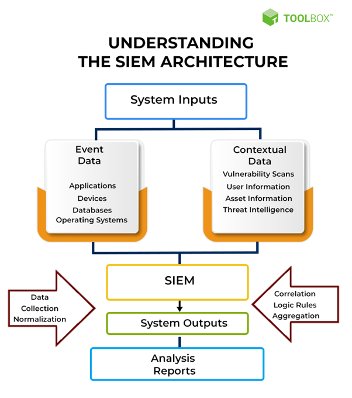

*Figure 2.1 (thesis, adapted from Mohanan 2022): The generic SIEM pipeline
— System inputs (event data + contextual data) feed data
collection/normalisation, correlation/logic/aggregation, and system
outputs (analysis + reports). The dataset analysed below sits at the
output of that pipeline in a Wazuh deployment.*

## Corpus characteristics

The dataset comes from the Wazuh alert index collected through the
organisation's SIEM architecture. It is alert-centric: dominated by time
artifacts, host/agent identities, and rule/decoder attributes produced by
Wazuh's correlation engine.

| Metric | Value |
|---|---|
| Rows | 277,499 |
| Time range (Asia/Jakarta, local) | 2025-07-10 17:40 → 2025-08-12 15:44 |
| Distinct agents | 5 |
| Distinct source IPs (valid) | 2,359 |
| Distinct destination IPs (valid) | 200 |
| Distinct source ports (valid) | 13,515 |
| Distinct destination ports (valid) | 568 |

## Column coverage

Non-null coverage is highest on `timestamp`, `agent.name`, `rule.groups`,
`rule.id`, and `rule.level` (100%). `decoder.name` is also well-populated
(≈87.6%). Network artifacts and geolocation are comparatively sparse:
`event_type` and `proto` sit around 34.8%, `dest_port` at 33.4%, `srcip`
at 17.3%, `country_name` at 17.2%, and MITRE mappings
(`rule.mitre.tactic`/`rule.mitre.technique`) at ~11.9%.

| Column | Coverage | | Column | Coverage |
|---|---|---|---|---|
| `_source.timestamp` | 100% | | `_source.data.dest_port` | 33.4% |
| `_source.agent.name` | 100% | | `_source.data.srcip` | 17.3% |
| `_source.rule.groups` | 100% | | `_source.GeoLocation.country` | 17.2% |
| `_source.rule.id` | 100% | | `_source.rule.mitre.tactic` | 11.9% |
| `_source.rule.level` | 100% | | `_source.rule.mitre.technique` | 11.9% |
| `_source.decoder.name` | ≈87.6% | | `_source.data.direction` | 11.6% |
| `_source.agent.ip` | ≈70.7% | | `_source.data.srcport` | 7.9% |
| `_source.full_log` | ≈59.9% | | `_source.data.srcuser` | 7.9% |
| `_source.data.event_type` | 34.8% | | `_source.GeoLocation.city/region` | 6–7% |
| `_source.data.proto` | 34.8% | | | |

**This coverage pattern is the reason feature engineering focuses on the
temporal / host / rule / decoder dimensions first** — they are the only
signals reliably present on every row.

## Temporal patterns

### Events per day

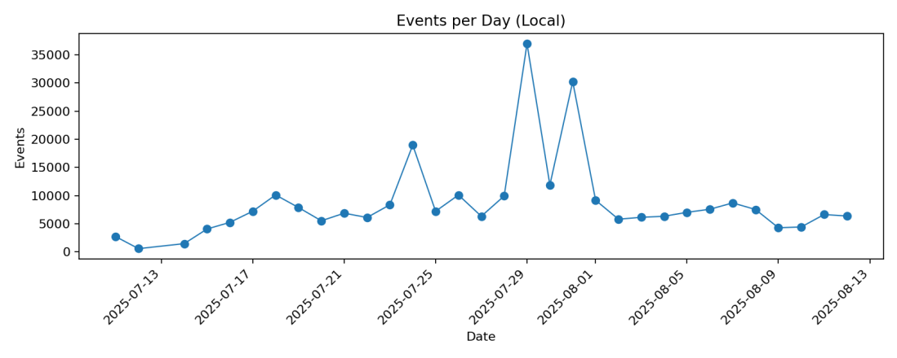

*Figure 4.9 (thesis): Daily alert volume across the 34-day window. Clear
variation in baseline operational rhythm, with noticeable spikes that set
up the case for per-day (rather than absolute-threshold) triage.*

### Hour-of-day distribution

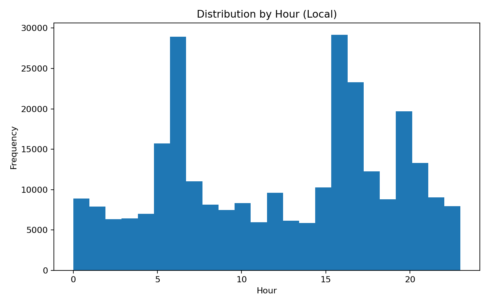

*Figure 4.10 (thesis): Histogram of events across 24 hours (local time).
Two pronounced peaks — early-morning (~06:00) and late-afternoon to early
evening (~16:00–20:00). This drives the `hour_local` and `hour_bucket`
features.*

### Weekday distribution

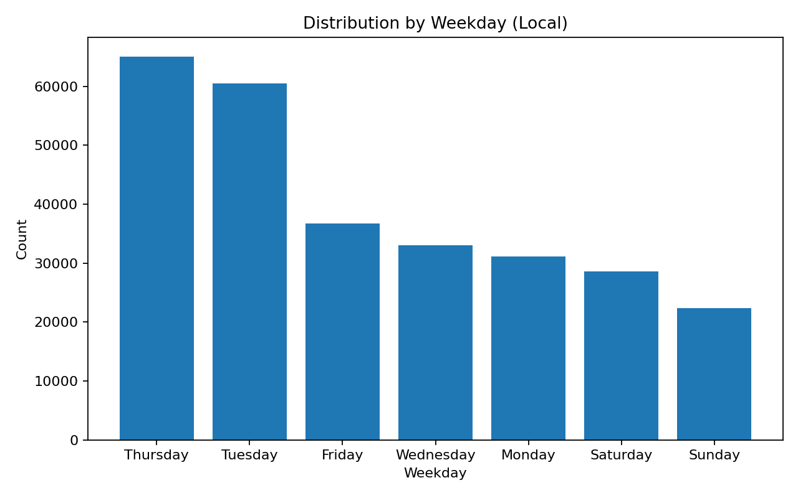

*Figure 4.11 (thesis): Alerts by weekday. Thursday and Tuesday are the
highest-volume days. Motivates the `day_of_week` and `is_weekend`
features.*

### Off-hours vs business-hours

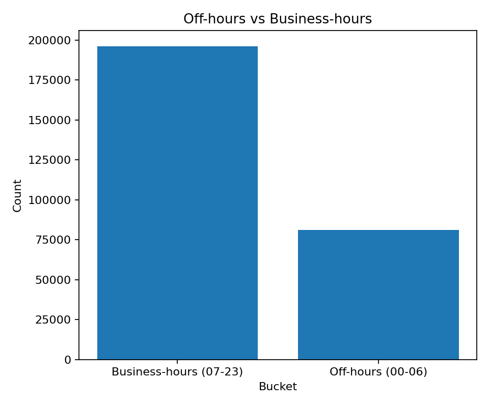

*Figure 4.12 (thesis): Share of events during off-hours (00:00–06:59)
versus business hours. Off-hours represent ~29.3% of the corpus —
substantial enough that an `is_off_hours` flag is a load-bearing feature
rather than a rare special case.*

### Hour × weekday heatmap

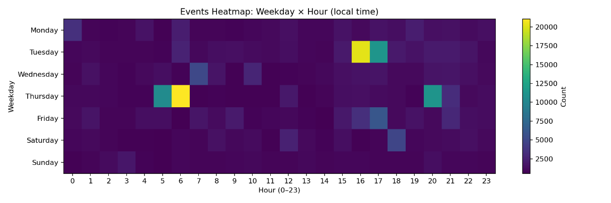

*Figure 4.13 (thesis): Event density mapped to (hour × weekday) slots. The
visual fingerprint of "normal activity" per host cohort; drift from this
pattern is what the ranker should catch.*

## Rule-space patterns

### Rule level distribution

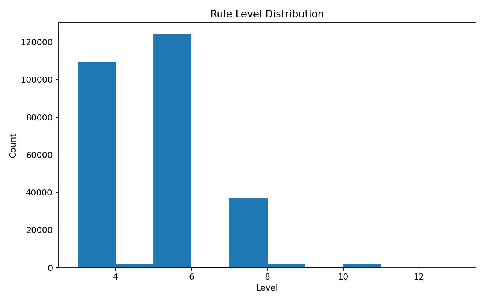

*Figure 4.14 (thesis): Distribution of `rule.level`. Strong concentration
around levels 3 and 5, with very rare high-severity (≥ 10). Absolute
severity is therefore a poor anomaly signal on its own; a **per-host
z-score** (`rule_level_z_host`) is what exposes meaningful deviations.*

### Top rule IDs

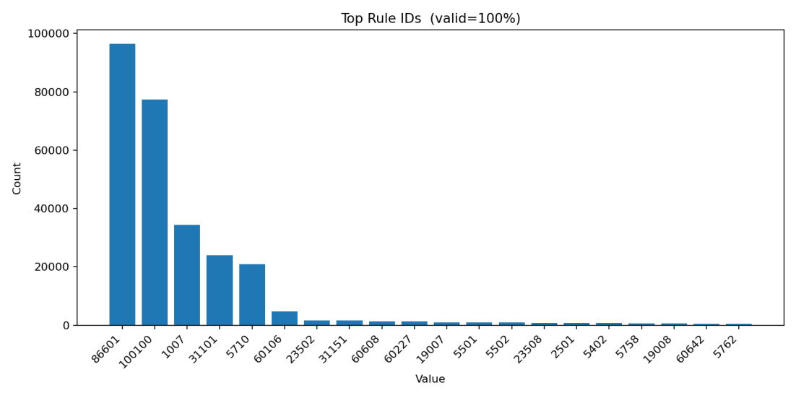

*Figure 4.15 (thesis): Rule-ID frequency, head-heavy distribution. A small
set of rules dominates volume; the long tail is where rarity-based
signals such as `agent_rule_hour_freq_log1p` earn their keep.*

### Top rule groups

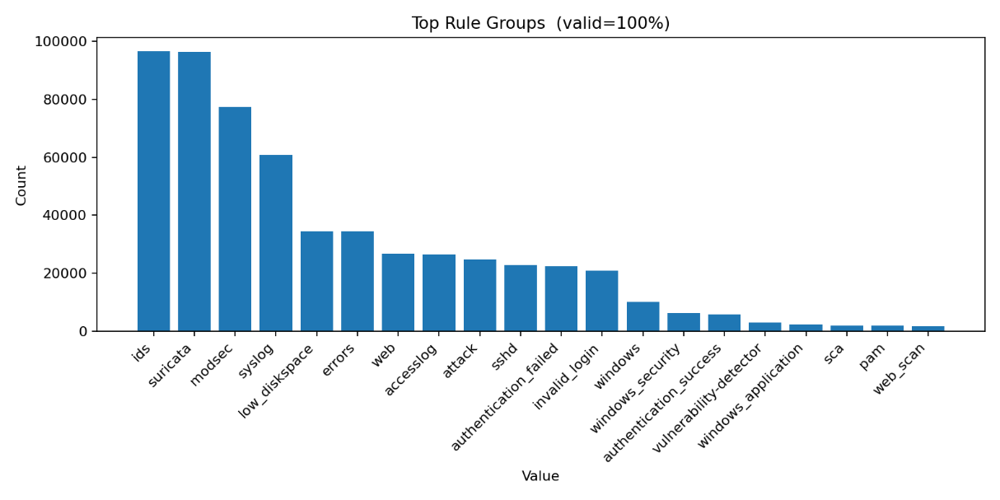

*Figure 4.16 (thesis): Rule-group frequency. Reflects a web-facing +
system-logging ecosystem (IDS / Suricata / ModSec / syslog), which shaped
the choice of context-aware features.*

### Top decoders

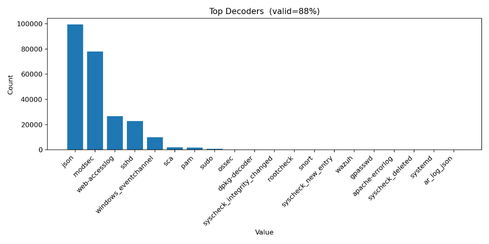

*Figure 4.17 (thesis): Decoder frequency. JSON, ModSec, and web-access
logs dominate. The combination of decoder-rule-hour per host becomes the
core of the rarity features.*

## Agent distribution

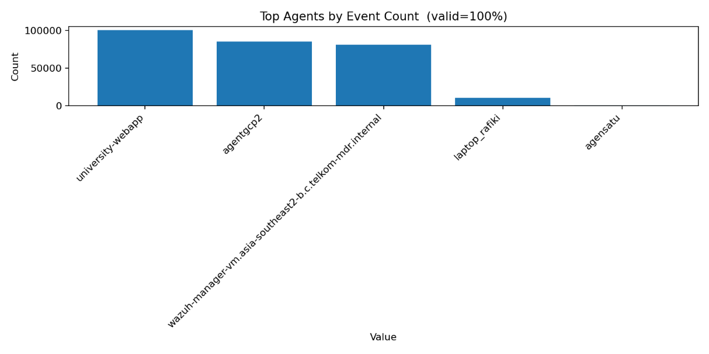

*Figure 4.18 (thesis): Event counts per agent. A small number of hosts
account for most traffic. This argues for **per-host baselining** — so
ranking isn't dominated by sheer volume from a single noisy agent — and
for per-host z-score normalisation of severity.*

## What EDA tells the feature spine

Putting it all together, three things stand out:

1. **Temporal signal is strong and ubiquitous.** Timestamps are 100% filled and both daily and hourly patterns are visibly structured. Off-hours is a meaningful ~29% of traffic, not a curiosity.
2. **Severity is only interpretable in context.** Level 5 is common. Level 5 *on a host whose mean is 3* is the real signal — hence per-host z-score.
3. **Rarity has to be measured in the right slice.** Globally common rules exist; rarity by `(agent × rule × hour_bucket)` is what captures surprise for a given host at a given time of day.

These three observations directly drive the feature families documented in
[Methodology → Feature engineering](methodology.md#feature-engineering).
