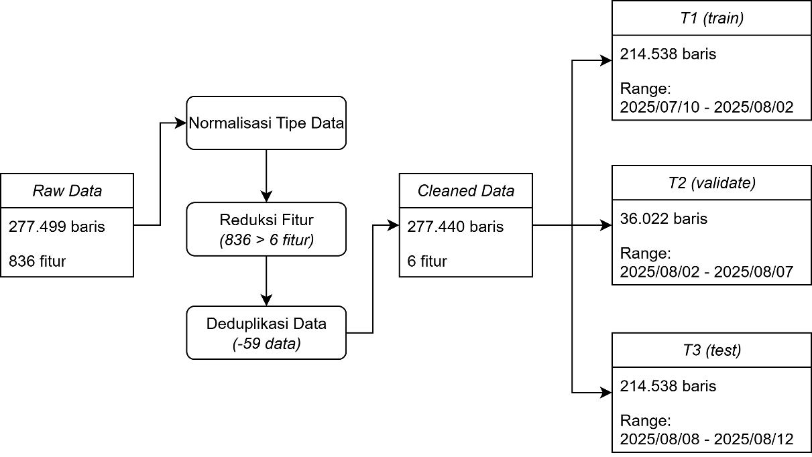
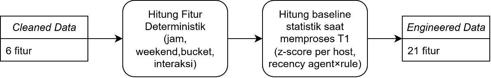

# Methodology

This document mirrors Chapters IV.2.2, IV.2.3, and IV.2.4 of the thesis —
the three decisions that turn a raw SIEM corpus into a model-ready
dataset, and the modelling framework on top of it. Explanatory figures
are reproduced from the published thesis.

## Research frame

The thesis follows **CRISP-DM** (Cross-Industry Standard Process for Data
Mining) as the process framework. The mapping is direct:

| CRISP-DM phase | What it means here |
|---|---|
| Business understanding | SOC alert fatigue → reframe as ranked triage under a daily attention budget |
| Data understanding | Coverage analysis on 836 columns; choose temporal + identity + rule metadata as the reliable signal (see [eda.md](eda.md)) |
| Data preparation | Canonicalise 6 columns, deduplicate, fix placeholders, enforce timezone; split temporally |
| Modelling | k-NN, Isolation Forest, LOF compared; frozen feature transformers; no leakage |
| Evaluation | Budgeted triage metrics (precision@p, recall@p, lift@p, FPR@p) on T2 + T3 |
| Deployment | Out of scope for the BSc thesis; pilot-grade service scaffolding is included |

Solution selection used **Analytical Hierarchy Process (AHP)** over seven
weighted criteria (alert-fatigue reduction, contextualisation quality,
implementation complexity, cost/sustainability, scalability, Wazuh
integration, correlation/feedback). Advanced analytics via machine learning
scored 4.30/5 — the highest of five alternatives, which also included
headcount expansion, rule-based enhancement, commercial SOAR, and
commercial SIEM migration.

## Reframing detection as ranking under a budget

A naïve formulation is *binary classification*: label every alert as
"anomaly" or "normal" and report precision/recall globally. In a real SOC
that breaks down in two ways:

1. **Analyst capacity is fixed.** A SOC analyst can triage roughly *k*
   alerts per day. If the classifier produces 10× that many "positives",
   the analyst silently reverts to sorting by severity — the model
   contributes nothing.
2. **Threshold drift is undetectable.** As traffic shape changes over
   time, a fixed decision threshold drifts: yesterday's "90% precision"
   quietly becomes today's "40% precision" without anyone noticing.

The reframing is simple: fix the budget *p* (e.g. 1% of daily events) and
optimise metrics *inside that slice*. The operating point is explicit in
the metric name, so drift is observable day over day.

- **precision@p** — fraction of the top-*p* slice that are true positives
- **recall@p** — fraction of all true positives captured inside the slice
- **lift@p** — ratio vs random sampling at the same budget
- **FPR@p** — false-positive rate inside the slice

At p = 1%, random sampling gives lift ≈ 1.0; anything above that is
genuine triage value.

## Data cleaning (IV.2.2)

*Figure 4.19 (thesis): End-to-end cleaning flow, left to right.
**Raw Data** (277 499 rows × 836 features) → **Normalisasi Tipe Data**
(type normalisation) → **Reduksi Fitur (836 > 6 fitur)** (drop 830+
sparse columns) → **Deduplikasi Data (-59 data)** (remove duplicate
`event_id`s) → **Cleaned Data** (277 440 rows × 6 features). The
cleaned table is then split temporally into **T1 (train)** 214 538
rows covering 2025-07-10 → 2025-08-02, **T2 (validate)** 36 022 rows
covering 2025-08-02 → 2025-08-07, and **T3 (test)** 26 880 rows
covering 2025-08-08 → 2025-08-12.*

The cleaning step is deliberately conservative and deterministic:

1. **Canonical column selection.** The raw schema contains 836 columns;
   only six are needed for modelling: `event_id`, `timestamp`, `agent`,
   `rule_id`, `rule_level`, `decoder`. These are the columns consistently
   present across the whole dataset (see [eda.md → Column coverage](eda.md#column-coverage)).
2. **Schema mapping with fallback.** Wazuh/Elastic schemas vary between
   sources; the cleaning step uses an explicit mapping from candidate
   names (`_source.agent.name`, `_source.agent.id`, `agent.name`,
   `agent.id`, …) to the canonical name. Mapping prefers
   `_source.agent.name` and falls back to `_source.agent.id` to keep
   coverage at 100%.
3. **Type enforcement.** `event_id`, `agent`, `rule_id`, `decoder` as
   string; `rule_level` as nullable `Int64`; `timestamp` parsed as
   `datetime64[ns]` from the Kibana format `"%b %d, %Y @ %H:%M:%S.%f"`
   with `errors="coerce"` so invalid values become `NaT` and are dropped
   downstream.
4. **Deduplication.** By `event_id`: 59 rows removed (0.02% of the
   corpus).
5. **Feature reduction.** 836 → 6 columns (99.28% reduction) by dropping
   placeholder-heavy families (GeoLocation, ModSec transaction
   parameters, Windows EventChannel specifics, flow statistics, HTTP
   transaction parameters) that would introduce noise rather than
   signal.

Validation after cleaning confirms the six canonical columns contain
**zero missing values** across all 277,440 remaining rows, so every row
passes the schema contract required by downstream feature engineering.

### Temporal T1 / T2 / T3 split

All splits are strictly temporal. The order matches how a SOC deployment
moves forward in time: train on the past, validate on the near past,
hold out the true future.

| Split | Role | Rows (thesis) | Time relation |
|-------|------|---------------|---------------|
| **T1** | Training window | 214,538 | `timestamp ≤ 2025-08-02 23:59:59.999999` |
| **T2** | Validation with synthetic injection | 36,022 | `2025-08-03 ≤ timestamp ≤ 2025-08-07 23:59:59.999999` |
| **T3** | Prospective hold-out | 26,880 | `timestamp ≥ 2025-08-08 00:00:00` |

A random K-fold split would allow a model to cheat by memorising
per-host habits that change across days. Temporal splitting forbids
this, matching the deployment reality where yesterday's patterns drive
tomorrow's scoring.

### No-leakage invariant

Feature transformers — per-host `rule_level` mean/stdev, recency median,
agent × rule × hour combo frequency table — are **fit once on T1** and
**frozen** as a JSON statistics file. At T2 and T3 time, the `apply`
mode reads that JSON and evaluates features against the frozen
statistics. See `src/pipeline/06_engineer_features.py`.

This guarantees three things:

1. No statistic derived from validation/hold-out data reaches the model.
2. Results are reproducible: re-running `apply` against the same stats
   file always produces the same features.
3. Deployment parity: the service loads the same stats at inference time
   that were used to measure validation performance.

## Feature engineering (IV.2.3)

*Figure 4.20 (thesis): Two-stage feature-engineering flow.
**Cleaned Data** (6 features) → **Hitung Fitur Deterministik** (jam,
weekend, bucket, interaksi — i.e. hour, weekend flag, time buckets,
and interaction features derivable row-by-row) → **Hitung baseline
statistik saat memproses T1** (fit contextual baselines while
processing T1: per-host z-score, agent × rule recency) →
**Engineered Data** (21 features). Everything computed against T1
baselines is frozen and re-applied identically to T2/T3/inference —
this is how the no-leakage invariant is enforced in practice.*

Feature engineering is anchored in three signal families plus
interactions. This parsimony is deliberate: the thesis argues that
adding more features is *not* the bottleneck — what matters is that the
features selected are (a) high-coverage on real Wazuh data, (b) cheap to
compute, and (c) explainable to an analyst without further training.

### Feature families

- **Temporal** — `hour_local`, `is_off_hours`, `day_of_week`,
  `is_weekend`, `second_in_hour`, `seconds_in_hour_bucketed`,
  `hour_bucket`. Captures daily and weekly rhythms.
- **Severity (host-relative)** — `rule_level_z_host`: per-host z-score of
  `rule.level`, fit on T1 and frozen. A rule-level of 10 means different
  things on different hosts; the z-score normalises that.
- **Recency** — `rule_time_since_last_host`,
  `rule_time_since_last_host_log1p`. Time since the same rule was last
  fired on the same host; `log1p` stabilises the scale.
- **Rarity / co-occurrence** — `agent_rule_hour_hash01` (stable blake2b
  hash of `agent × rule_id × hour_bucket` mapped to `[0, 1]`),
  `agent_rule_hour_freq_log1p` (log1p of the combo frequency from T1).
  Captures surprise: rare `(host, rule, hour)` combinations stand out.
- **Cross interactions** — `offhours_x_rule_level`,
  `offhours_x_rule_level_z`, `weekend_x_rule_level_z`,
  `recency_x_rule_level`. Models the intuition analysts routinely apply
  ("high severity, off-hours, and on a host that never fires this rule
  at this hour" is a sharper signal than any component alone).

### Deliberately excluded features

A set of candidate features was evaluated and rejected because distribution
analysis on the real corpus showed they would not discriminate:

- **Rule / decoder novelty per host** — nearly every rule and decoder in
  T2/T3 was already seen on that host in T1, so novelty saturates.
- **Geolocation** — > 80% of rows are placeholder / empty.
- **Source / destination ports** — distribution is heavy on common
  services (SSH/HTTP); doesn't separate normal from anomalous.
- **Raw log text** — not consistent across sources.

The rejection log is itself a feature of the methodology: every retained
feature has been weighed against a concrete, rejected alternative.

## Data modelling (IV.2.4)

Three unsupervised anomaly-detection algorithms are considered because
their inductive biases are complementary given the shape of the data:

1. **k-Nearest Neighbor (k-NN) anomaly scoring.** k-NN excels when the
   rarity signal is contextual (e.g. an `agent × rule × hour` combo
   that is rare on a specific host). Feature-contribution explanations
   can be summarised as reason codes at the operational level
   ("high-scoring because off-hours + `rule_level_z` above threshold on
   this host").
2. **Isolation Forest (IF).** Good at detecting global outliers and
   relatively efficient at moderate dimensionality, but may need
   `contamination` tuning and can be less sensitive to local anomalies
   sitting near a minor but operationally relevant cluster.
3. **Local Outlier Factor (LOF).** Effective for highlighting local
   anomalies but can show higher variance on corpora with heterogeneous
   density between hosts or time windows. Choice of *k* and
   context-partitioning policy (global vs per-host) matters.

### Selection criteria (applied at training time)

The pilot uses four explicit criteria in early candidate filtering
before concentrating hyperparameter tuning:

1. **Budgeted-triage performance.** The algorithm must demonstrate
   convincing `precision@K/p` and `lift@p` at a realistic review
   budget — e.g. Top-p ≈ 1% or an equivalent fixed Top-K.
2. **Day-to-day stability.** Ranking should not be excessively noisy as
   daily data changes; the team needs predictable workload and
   consistent triage quality.
3. **Adequate explainability.** Each score should come with analyst-
   interpretable cues (reason codes) so investigation time is short and
   operational adoption is easier.
4. **Computational efficiency and integration.** The algorithm must run
   efficiently at daily batch or near-real-time cadence and integrate
   cleanly with the established pipeline (artifact storage, indices,
   feature schema).

### Why precision@K/p + lift@p are the right metrics

- **Aligns with budgeted triage.** Capacity is bounded at K/day or
  fraction p; the metric maps directly to the actual daily workload.
- **Robust to class imbalance.** SIEM data is heavily skewed; global
  accuracy and even AUC-ROC lose operational meaning, while
  head-of-list ranking metrics stay relevant.
- **Minimal dependence on threshold calibration.** Many unsupervised /
  one-class models produce uncalibrated scores; ranking-based
  evaluation stays consistent even when the score scale changes.
- **Stable across daily volume.** Top-p is proportional to the number
  of alerts, so day-to-day comparisons don't drift; Top-K is used when
  the team's capacity is a fixed number.
- **Easy to explain to stakeholders.** `lift@p` reads directly as
  "x times better than random at p%" — useful for SLAs and priority
  justification.
- **Supports human-in-the-loop.** Focusing on the top of the ranking
  makes it natural to attach reason codes and to do active learning on
  analyst feedback.

## MITRE ATT&CK coverage

The injection families and the feature spine were chosen so the pipeline
has a plausible hit surface for five common operational scenarios. Each
row below maps a behavioural signal observable in Wazuh telemetry to
ATT&CK techniques and explains why it matters for triage.

| Scenario | Signal in Wazuh telemetry | ATT&CK technique | Why it matters |
|---|---|---|---|
| Suspicious auth / remote access | Off-hours logon; unusual per-user login rhythm; spike in RDP/SSH/VPN | T1078 Valid Accounts · T1021 Remote Services · T1133 External Remote Services | Most common initial access and lateral-movement pathway; abuses legitimate credentials |
| Scheduled execution outside normal cycles | Task/job created or modified off-cycle; atypical parameters | T1053 Scheduled Task/Job (incl. T1053.003 Cron) | Gives persistence and automation; runs payloads with no user interaction |
| Service-based persistence | New or modified service/daemon outside change windows; abnormal start/stop | T1543 Create or Modify System Process (T1543.002 Systemd · T1543.003 Windows Service) | Survives reboots; blends with legitimate services |
| Rare or bursty interpreter use | PowerShell / cmd / Unix Shell spike on a normally quiet host at odd hours | T1059 Command and Scripting Interpreter (.001 PowerShell · .003 Windows CMD) | Interpreters are adversary-versatile: discovery, staging, payload execution |
| Rhythm pointing to scheduled exfiltration | Regular activity in a fixed time window correlated with data egress | T1029 Scheduled Transfer (with T1041 Exfiltration Over C2 · T1048 Alt. Protocol) | Exfiltration deliberately mimics business rhythm; late detection = data loss |

The four synthetic injection families in `src/pipeline/05_inject_synthetic.py`
(`offhours_shift`, `rule_new`, `decoder_new`, `level_out`) are stylised
surrogates for these scenarios, chosen because they can be generated
without adversary-specific heuristics and because the detector has to
find them using the same features it would use in production.

## Explainability layer

For every top-K row the service returns a `reason` payload with:

1. **Top contributing features** — per-feature delta `Δscore` if the
   value were replaced with the training-set median. Features whose
   replacement collapses the score the most are the "reasons" the alert
   ranked high.
2. **Neighbour-median comparator** — what the nearest-neighbour group
   looks like for this host on each feature. Gives the analyst a local
   "what's normal here" reference.
3. **Context flags** — human-readable tags: `off-hours × high severity`,
   `new rule on this host`, etc.

Reference: `build_explain_outputs` and `occlusion_contributions` in
`src/service/gradio_app.py`. Figures 5.1 and 5.2 in [results.md](results.md)
show examples on real top-ranked alerts.
