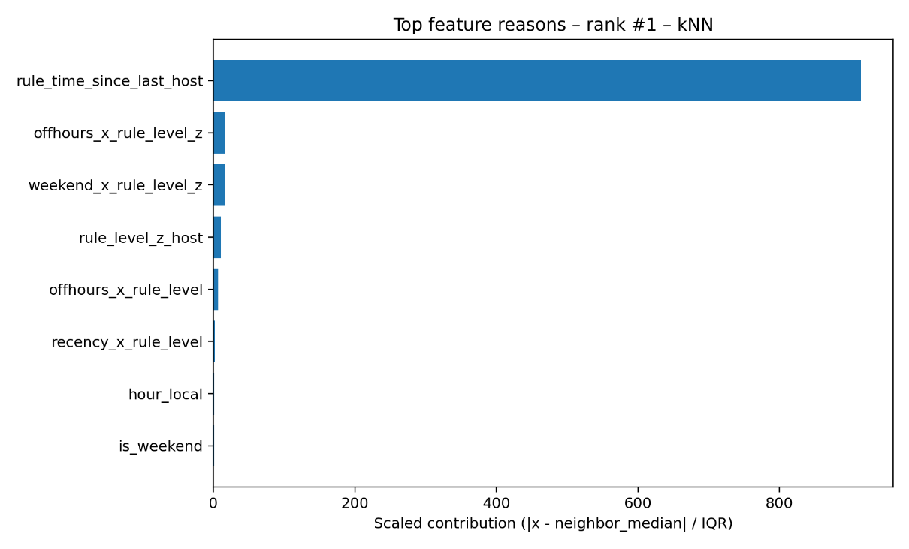
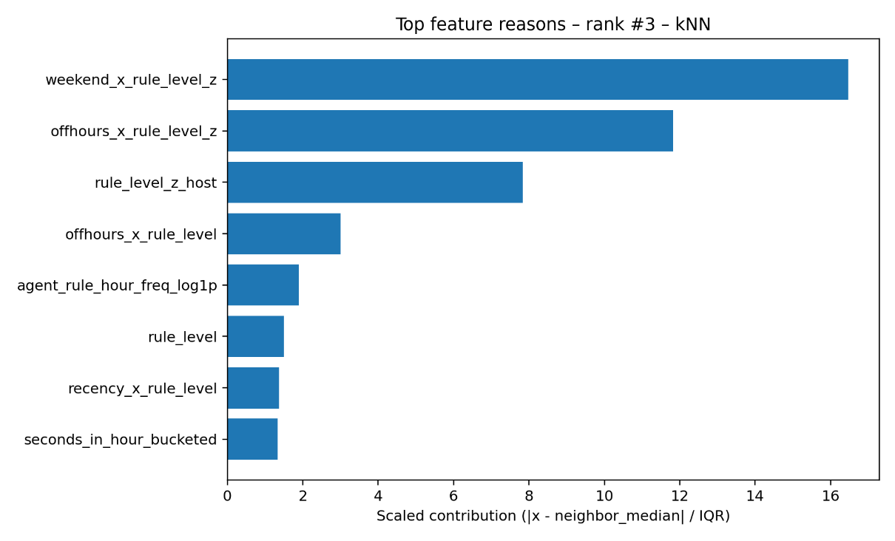
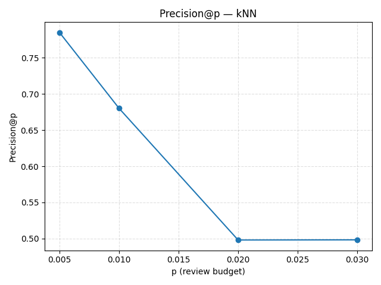
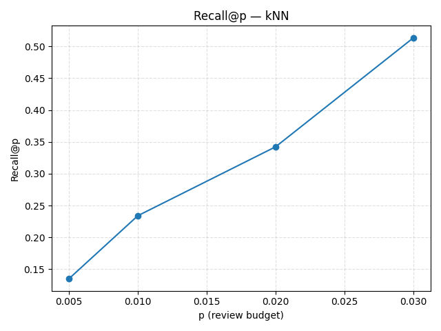
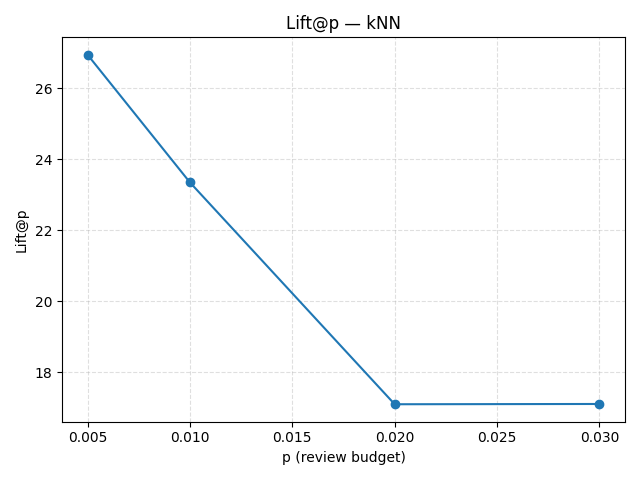
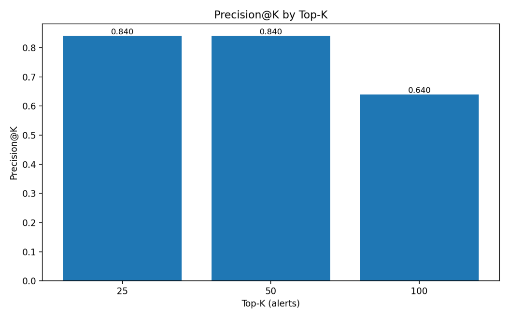
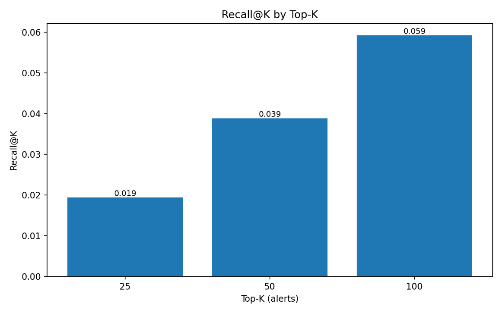
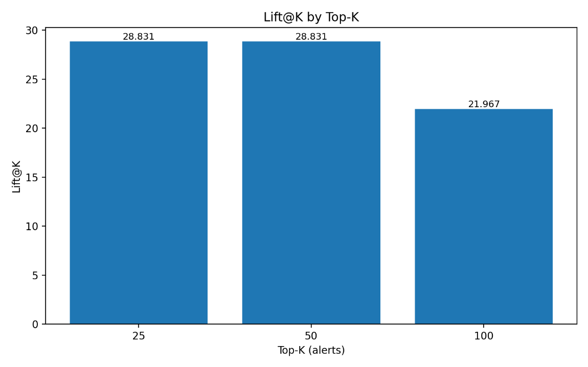
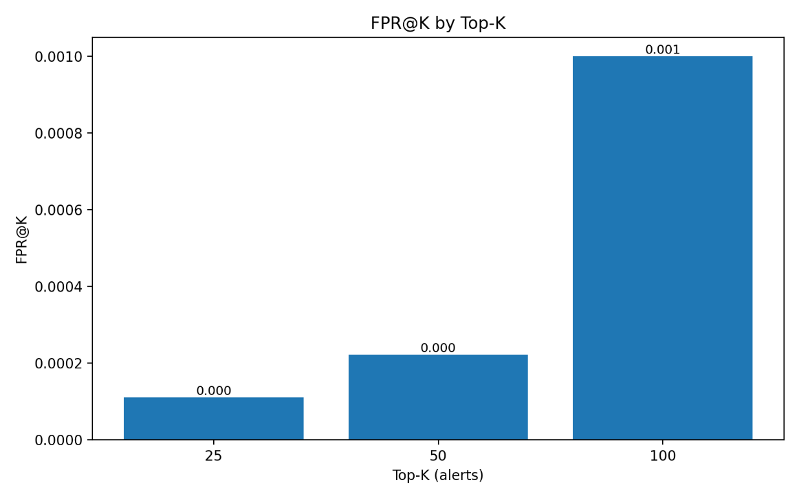
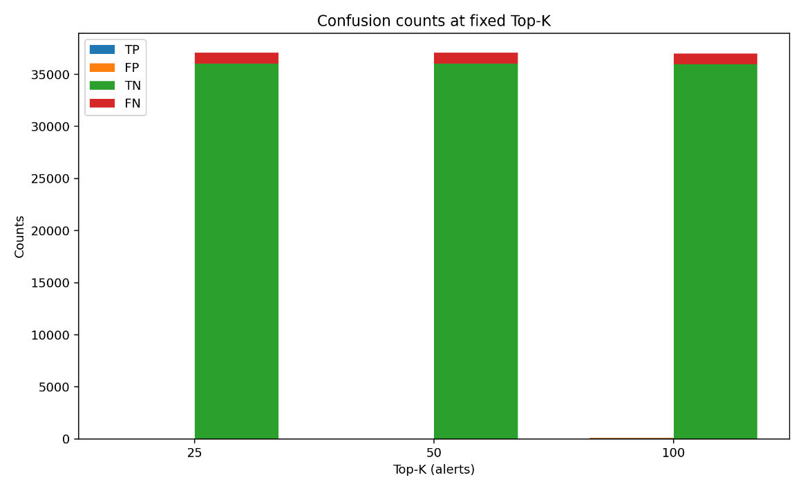

# Results

This document mirrors Chapter V.2 of the thesis (*Hasil Evaluasi* —
Evaluation Results). All numbers below are measured on real Wazuh SIEM
data from a production CSOC index (Telkom Indonesia, acknowledged in the
published thesis). The published code produces the same numbers when
pointed at the same data; the synthetic data generator in this repository
produces a similarly-shaped but much smaller dataset, so absolute numbers
there will differ.

## Corpus

| Metric | Value |
|---|---|
| Date range | 10 Jul 2025 17:40 – 12 Aug 2025 15:44 (Asia/Jakarta) |
| Total alerts (raw) | 277,499 |
| Total alerts (after dedup) | 277,440 |
| Distinct agents | 5 |
| Distinct source IPs | 2,359 |

## Split sizes

| Split | Rows | Role |
|---|---|---|
| T1 | 214,538 | Training window — transformers fit here |
| T2 | 36,022 | Validation window with 1–3%/day synthetic injections |
| T3 | 26,880 | Prospective hold-out (true future) |

## Hyperparameter tuning and model selection (V.2.1)

Three unsupervised algorithms were tuned on T2 (with synthetic
injections) at the operating budget p = 1%. Best-of-each:

| Model | Config | Precision@1% | Recall@1% | Lift@1% | FPR@1% |
|-------|--------|--------------|-----------|---------|--------|
| **k-NN** | k=35 | **0.6801** | **0.2340** | **23.34×** | **0.0033** |
| Isolation Forest | 600 trees, 0.5 sample fraction, 0.8 max_features, bootstrap=True | 0.4032 | 0.1388 | 13.84× | 0.0061 |
| LOF | k=20, `novelty=True` | 0.3010 | 0.1036 | 10.33× | 0.0072 |

- k-NN beats Isolation Forest by ~1.69× on precision and ~1.69× on lift.
- k-NN beats LOF by ~2.26× on precision and ~2.26× on lift.
- All three produce FPR@1% below 1%, so even the weakest baseline would
  not flood an analyst queue. At p = 1% the question is *who hands the
  analyst the right items*, not *who floods the queue*.

### Reason codes — why the top-ranked alerts are top-ranked

The ranker's output is paired with **reason codes**: a per-alert
attribution that shows which features pushed the score up, and what the
"normal neighbour" baseline looks like on each of those features. This is
what converts a score into something an analyst can act on in seconds.

*Figure 5.1 (thesis): Top feature contributions for the #1-ranked alert
under k-NN, ordered by scaled contribution ( |x − neighbor_median| /
IQR ). A single feature — `rule_time_since_last_host` — dominates at
~900, signalling that this rule hasn't fired on this host for an
unusually long window. Secondary contributions come from
`offhours_x_rule_level_z`, `weekend_x_rule_level_z`, and
`rule_level_z_host`, all in a much lower (~10–15) range. The shape of
this chart — one runaway bar, everything else small — is characteristic
of "dormant rule reactivates" anomalies.*

*Figure 5.2 (thesis): Top feature contributions for the #3-ranked alert
under the same k-NN model. The driver shifts entirely: no single
outlier, but `weekend_x_rule_level_z` (~16),
`offhours_x_rule_level_z` (~12), `rule_level_z_host` (~8),
`offhours_x_rule_level` (~3), `agent_rule_hour_freq_log1p` (~2), and
`rule_level` (~1.5) stack together. The pattern points to a
"high-severity event on a host during an unusual weekend-off-hours
window" — a qualitatively different class of anomaly that the same
model surfaces with a qualitatively different explanation.*

These explanations aren't a separate post-hoc tool; they fall out of the
k-NN distance computation directly, which is why explainability is cheap
and consistent with the scoring path.

## Operating-point analysis — Top-p sweep (V.2.2)

For the winning k-NN configuration, precision, recall, and lift were
measured across a range of operating budgets *p*. The pattern matches the
canonical tradeoff of budgeted triage: tighter budget → higher precision,
wider budget → higher recall.

### Precision vs p

*Figure 5.3 (thesis): `precision@p` for k-NN across four review
budgets — 0.5%, 1%, 2%, 3%. Precision starts at ~0.785 at p = 0.5%,
drops to 0.680 at p = 1% (the chosen operating point), then flattens
to ~0.498 for p = 2% and p = 3%. The sharp step between p = 1% and
p = 2% is the natural "shoulder" that motivates p = 1% as the default
budget.*

### Recall vs p

*Figure 5.4 (thesis): `recall@p` rises nearly monotonically with the
budget: 0.135 at p = 0.5%, 0.234 at p = 1%, 0.343 at p = 2%, 0.513
at p = 3%. Widening the slice from 1% to 3% roughly doubles the
coverage of true positives, which is the knob a SOC can turn when it
has extra analyst capacity on a given day.*

### Lift vs p

*Figure 5.5 (thesis): `lift@p` versus review budget. 26.94× at
p = 0.5%, 23.34× at p = 1%, then a step down to 17.10× at p = 2% and
p = 3%. The lift curve mirrors the precision curve almost exactly
(precision divided by the constant 2.91% prevalence), so a manager
reading this chart gets an SLA-friendly number — "about 23× better
than random" — without needing the full confusion matrix.*

### k sweep at p = 1%

| k  | Precision@1% | Recall@1% | Lift@1% | FPR@1% |
|----|--------------|-----------|---------|--------|
| 5  | 0.6640 | 0.2285 | 22.79× | 0.0035 |
| 10 | 0.6694 | 0.2303 | 22.97× | 0.0034 |
| 20 | 0.6720 | 0.2313 | 23.07× | 0.0034 |
| **35** | **0.6801** | **0.2340** | **23.34×** | **0.0033** |
| 50 | 0.6747 | 0.2322 | 23.16× | 0.0034 |
| 100| 0.6586 | 0.2266 | 22.61× | 0.0035 |

k = 35 is the precision peak; k ≤ 10 under-smooths, k ≥ 75 over-smooths
the locality that k-NN is exploiting.

### Best-of-k at different p

| p | best k | Precision@p | Recall@p | Lift@p | FPR@p |
|---|--------|-------------|----------|--------|-------|
| 0.5% | 5  | 0.8118 | 0.1397 | 27.86× | 0.0010 |
| **1%** | **35** | **0.6801** | **0.2340** | **23.34×** | **0.0033** |
| 2% | 50 | 0.5034 | 0.3460 | 17.28× | 0.0102 |
| 3% | 35 | 0.4982 | 0.5134 | 17.10× | 0.0155 |

**p = 1% is chosen as the primary operating point** because it balances
high precision (0.68) with useful recall (0.23) and delivers > 23× lift
with < 0.33% FPR.

## Fixed-K operating points — capacity planning (V.2.3)

SOC capacity is often expressed as "alerts per analyst per shift", a fixed
*K*, rather than a proportion. The same model is therefore also evaluated
at three fixed-K budgets so a manager can translate the ranker directly to
headcount.

| Top-K | Precision@K | Recall@K | Lift@K | FPR@K | TP | FP | FN | TN |
|-------|-------------|----------|--------|-------|----|----|----|----|
| 25 | **0.84** | 0.0194 | 28.83× | 0.0001 | 21 | 4 | 1,060 | 36,018 |
| 50 | **0.84** | 0.0388 | 28.83× | 0.0002 | 42 | 8 | 1,039 | 36,014 |
| 100 | 0.64 | 0.0592 | 21.97× | 0.0009 | 64 | 36 | 1,017 | 35,986 |

### Precision@K

*Figure 5.6 (thesis): Bar chart of `Precision@K` at the three fixed
budgets. 0.840 at K = 25, 0.840 at K = 50, 0.640 at K = 100. Precision
is flat through K = 50, meaning doubling the queue from 25 to 50 does
not dilute quality — every extra alert analysts read is about as
likely to be relevant as the first 25.*

### Recall@K

*Figure 5.7 (thesis): Bar chart of `Recall@K`. 0.019 at K = 25, 0.039
at K = 50, 0.059 at K = 100. Coverage roughly doubles from K = 25 to
K = 50, then rises sub-linearly — the precision-coverage trade-off
bends around K = 50.*

### Lift@K

*Figure 5.8 (thesis): Bar chart of `Lift@K`. 28.831× at K = 25,
28.831× at K = 50, 21.967× at K = 100. Lift is flat through K = 50 and
decays at K = 100 — the same breakpoint the precision chart shows, as
expected.*

### FPR@K

*Figure 5.9 (thesis): `FPR@K` in the non-anomalous population. Very
small at K = 25 (~0.0001), still small at K = 50 (~0.0002), and reaches
~0.001 at K = 100. Even at the widest budget, fewer than 0.1% of
legitimate alerts end up in the queue — noise is tightly contained.*

### Confusion counts at fixed K

*Figure 5.10 (thesis): Stacked bars of TP / FP / TN / FN counts at
K = 25, 50, 100. The vast majority of the volume is TN (~36 000
non-anomalies correctly left out of the queue — the tall green
blocks); FN (red) is the residual anomalies that didn't make the
slice; TP and FP are small in absolute counts but are the only
quantities that matter to the analyst experience, and they evolve
exactly the way Figures 5.6 and 5.9 predict.*

### Practical capacity translation

A three-analyst shift with a 50-alert quota per analyst can expect
roughly **126 true positives per day** (3 × 42) against **24 false
positives**, for a ~5:1 signal-to-noise ratio inside the queue.

## What these numbers do and do not mean

The thesis evaluation measures whether *synthetic-but-ATT&CK-shaped*
anomalies can be pulled to the top of a 1%-per-day slice. They are strong
evidence that:

- the pipeline architecture works,
- k-NN is the right algorithm family for this feature space,
- the T1/T2/T3 + frozen-transformer methodology produces reproducible
  numbers.

They are **not** evidence that the system catches all real-world insider
threats, zero-day campaigns, or adversarial evasion — that requires
either a longer prospective deployment study or a red-team engagement.
The production roadmap documented in the main README (closed-loop RL /
active learning, real-incident labels replacing synthetic) is the path
toward those harder evaluations.
